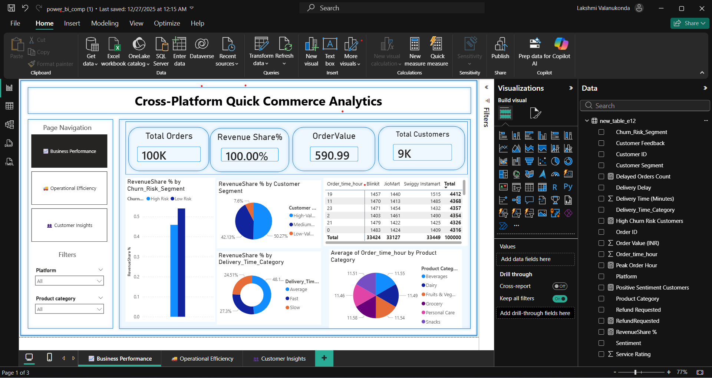

# Comparative-Quick-Commerce-Performance-Analysis
Data Analytics Project

## 📁 Repository Structure & File Descriptions

| File Name | Description |
|---------|-------------|
| **Ecommerce_Delivery_Analytics_New.csv** | Raw dataset containing quick-commerce order data from Blinkit, JioMart, and Swiggy Instamart, including order values, delivery times, refunds, ratings, and customer feedback. DataSetlink --- https://www.kaggle.com/datasets/logiccraftbyhimanshi/e-commerce-analytics-swiggy-zomato-blinkit/data |
| **datapreprocessing_ComparativeQuickcommerce.py** | Python script used for data cleaning and preprocessing. Handles missing values, datetime conversion, categorical standardization, sentiment cleaning, and feature engineering.and converting the csv file to Mysql table and keep that in a database |
| **datavisualisation_comparative_quick_commerce_analysis.py** | Python file used for exploratory data analysis (EDA) and initial visualizations to understand trends and patterns before dashboard creation. |
| **sql_queries_dataunderstanding.sql** | SQL queries used for data understanding,  schema definition, and analytical querying after loading processed data into the SQL database. |
| **power_bi_comp (1).pbix** | Power BI report file containing interactive dashboards for Business Performance, Operational Efficiency, and Customer Insights using KPIs, slicers, and DAX measures. |
| **README.md** | Project documentation explaining the objective, dataset, preprocessing steps, analytics workflow, dashboards, and key insights. |

---
## 📊 Power BI Dashboard Generated

This dashboard provides insights into business performance, customer behavior, and operational efficiency using key performance indicators (KPIs), interactive visuals, and data-driven analysis.

## 🧭 Project Workflow
1. Raw data collection from CSV  
2. Data preprocessing and feature engineering using Python  
3. Data storage and querying using SQL  
4. Data visualization and storytelling using Power BI  
5. Business insight generation and platform comparison

# 📊 Comparative Quick-Commerce Performance Analysis

## 📌 Project Overview
This project is an **end-to-end data analytics solution** designed to compare the performance of three quick-commerce grocery delivery platforms: **Blinkit, JioMart, and Swiggy Instamart**.  
The objective is to analyze **business performance, operational efficiency, and customer behavior** and transform raw transactional data into **actionable insights** using data storytelling.

---

## 🎯 Objectives
- Compare revenue, order trends, and customer value across platforms  
- Analyze delivery efficiency, delays, refunds, and service ratings  
- Identify high-value, delay-sensitive, and churn-prone customer segments  
- Enable data-driven decision-making through interactive dashboards  

---

## 🧾 Dataset Description
Each row in the dataset represents a **customer order**, containing:
- Platform name  
- Order value  
- Delivery time and delays  
- Refund requests  
- Service ratings  
- Customer feedback and sentiment  
- Order date and time  

The dataset captures **business metrics, operational performance, and customer experience**, making it ideal for analytics and visualization.

---

## 🧹 Data Preprocessing (Python)
Data preprocessing was performed using **Python** to ensure accuracy and consistency:
- Handling missing and inconsistent values  
- Converting date and time columns to proper datetime formats  
- Standardizing categorical fields (platforms, delivery status)  
- Cleaning customer feedback and sentiment fields  

---

## 🛠 Feature Engineering
New features were created to extract deeper insights:
- **Customer Segmentation** based on order value  
- **Churn Risk Classification** using delays, refunds, and sentiment  
- **Delivery Speed Categories** (Fast, Average, Slow)  
- **Time-based features** such as order hour and peak periods  

These features transformed raw data into **business-understandable metrics**.

---

## 🗄 SQL Database Integration
- Created a structured **SQL (MySQL) database**  
- Defined appropriate schemas and data types  
- Loaded cleaned and transformed data for scalable querying  

This step reflects **real-world data handling practices**.

---

## 📊 Power BI Dashboard Development
The SQL database was connected to **Power BI**, where:
- Relationships and **DAX measures** were created  
- KPIs were designed for quick insights  
- Interactive visuals and slicers were added  
- Dynamic narratives were used for storytelling  

---

## 📈 Dashboards Overview

### 1️⃣ Business Performance Dashboard
**Answers:** *How is the business performing?*  
- Total orders  
- Revenue share  
- Average Order Value (AOV)  
- Customer base size  

**Insight:**  
Swiggy Instamart shows the highest revenue share and AOV, indicating stronger customer spending behavior.

---

### 2️⃣ Operational Efficiency Dashboard
**Answers:** *How efficiently are deliveries handled?*  
- Delivery delays  
- Refund requests  
- Service ratings  
- Peak order hours  

**Insight:**  
Platforms with fewer delays may still receive lower ratings, showing that **delay handling quality matters more than delay count**.

---

### 3️⃣ Customer Insights Dashboard
**Answers:** *Who are the customers and how do they behave?*  
- Customer count  
- Churn risk levels  
- Sentiment distribution  
- Revenue contribution by customer segment  

**Insight:**  
High-value customers contribute the majority of revenue, making **retention strategies critical**.

---

## 🧠 Key Takeaways
- Swiggy Instamart leads in **revenue efficiency and customer value**  
- Blinkit performs better in **operational efficiency**  
- JioMart shows **stable but comparatively lower efficiency**  
- Effective **data storytelling connects business, operations, and customer behavior**

---

## 🧰 Tech Stack
- **Python** (Pandas, NumPy)  
- **SQL (MySQL)**  
- **Power BI**  
- **Power Query & DAX**  
- **Machine Learning (Clustering & Classification logic)**  

---

## 🚀 Project Outcome
This project demonstrates a **complete analytics workflow**:
> Raw Data → Data Cleaning → Feature Engineering → SQL Database → Power BI Dashboards → Business Decisions

It highlights strong skills in **data analytics, visualization, SQL integration, and business insight generation**.

---

## 📎 Use Cases
- Data Analyst  
- Business Analyst  
- Power BI Developer  
- Junior Data Scientist  
- Analytics & Consulting Internships  

---

## 📬 Contact
**Lakshmi Prasanna**  
📧 Email: valanukondalakshmi755@gmail.com  
🔗 LinkedIn: https://www.linkedin.com/in/lakshmi-prasanna-valanukonda/  

---
